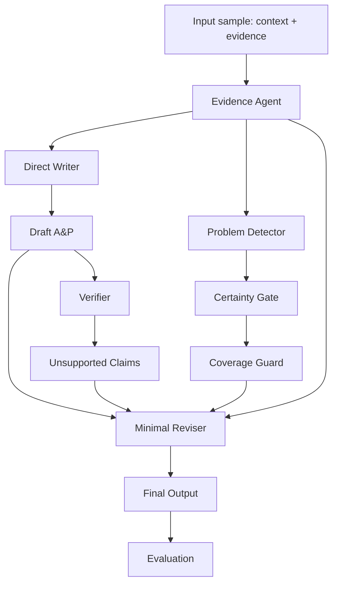

# ProblemFlow V6 技术报告：Draft-Preserving Evidence-Constrained Revision

## 1. 背景与目标

在临床文本生成任务中，直接使用 LLM 生成通常有两个优点：

- 覆盖率高，能够写出较完整的临床问题和计划。
- 语言风格接近医生书写，因此 ROUGE-L 等词面指标通常较好。

但直接生成也有明显问题：

- 容易补充“临床上合理但输入证据中没有”的计划。
- 容易把弱证据升级成明确诊断。
- 数值、趋势、药物和处置可能出现 unsupported claim。

ProblemFlow V5 采用 evidence-first multi-agent 生成方式，能显著降低 unsupported claim，但容易变得保守，导致 ROUGE-L 和问题覆盖下降。V6 的核心目标是解决这个 trade-off：

> 保留 direct baseline 的高覆盖和高 ROUGE，同时通过证据约束修订降低幻觉、提升 grounding。

因此 V6 不再从结构化 problem states 直接重写全文，而是采用：

```text
Direct high-coverage draft
→ Evidence / certainty / coverage guard
→ Unsupported claim verification
→ Minimal evidence-constrained revision
```

## 2. 当前项目中的 V6 实现位置

核心代码：

```text
experiments/problemflow_ap/problemflow_ap.py
```

关键函数：

```text
evidence_agent(...)
problem_detector_agent(...)
problem_gate_agent(...)
build_coverage_guard(...)
llm_direct_writer(...)
verifier_agent(...)
llm_reviser_agent(...)
generate(...)
```

当前 V6 相关逻辑：

```text
problemflow_v6 已注册到 PROBLEMFLOW_METHODS
problemflow_v6 属于 REVISION_PROBLEMFLOW_METHODS
V6 跳过 Problem State Agent
V6 使用 direct writer 生成 draft_ap
V6 使用 verifier 找 unsupported claims
V6 使用 minimal reviser 生成最终 generated_ap
```

## 3. V6 Pipeline



### 3.1 Evidence Agent

输入：

```json
{
  "current_note_context": "...",
  "ehr_events_before_cutoff": [
    {"evidence_id": "...", "text": "...", "source_type": "..."}
  ]
}
```

输出：

```json
[
  {
    "evidence_id": "109079_day2_raw0020",
    "text": "Hemoglobin is 17.10 g/dL. Glucose is 216 mg/dL...",
    "problem_ids": ["glucose_diabetes", "heme"],
    "trend": "unknown"
  }
]
```

职责：

- 将原始输入 evidence 标准化。
- 给 evidence 标注相关问题类别。
- 尽可能保留数值、药物、处置、趋势信息。

迁移到其他 benchmark 时，只需替换 evidence schema 和 problem taxonomy。

### 3.2 Problem Detector

输入：

```text
evidence
historical memory，可选
```

输出：

```json
["respiratory_failure_copd", "volume", "infection", "glucose_diabetes"]
```

职责：

- 从 evidence 中识别候选问题。
- 不负责最终写作。
- 不应过度过滤，宁可召回较高，再交给 certainty gate 控制输出级别。

### 3.3 Certainty Gate

Certainty Gate 是 V6 的关键安全模块。它把候选问题分成：

```text
primary_active      可作为独立段落
secondary_active    可作为 supportive care 或简短 bullet
evidence_only       只能监测或提及，不能升级成诊断
suppress            不输出
```

示例：

```json
{
  "primary_active": ["respiratory_failure_copd", "volume"],
  "secondary_active": ["infection", "glucose_diabetes", "prophylaxis_access"],
  "evidence_only": ["renal_aki", "heme"],
  "certainty": {
    "renal_aki": {
      "evidence_strength": "monitoring_only",
      "allowed_output_level": "mention_only",
      "reason": "Renal labs without AKI/high creatinine support monitoring, not AKI diagnosis."
    }
  }
}
```

设计原则：

- 弱证据不能升级成强诊断。
- 药物证据只能支持“coverage / monitoring / treatment”，不一定支持诊断。
- 单个 lab abnormality 不一定构成 active problem。
- routine ICU care 应集中在 supportive care，不应膨胀为多个问题。

### 3.4 Coverage Guard

Coverage Guard 是 V6 相比 V5 的关键新增模块。

它的作用不是删除内容，而是告诉 reviser：

```text
这些问题有证据支持，修订时不要因为追求低 hallucination 而删掉。
```

输出示例：

```json
{
  "primary_active": [
    {
      "problem_id": "respiratory_failure_copd",
      "label": "Respiratory failure / COPD",
      "evidence": [
        {
          "evidence_id": "...",
          "text": "pCO2 is 67 mm Hg. pO2 is 61 mm Hg.",
          "trend": "unknown"
        }
      ]
    }
  ],
  "secondary_active": [
    {
      "problem_id": "glucose_diabetes",
      "label": "Diabetes / hyperglycemia",
      "evidence": [
        {
          "evidence_id": "...",
          "text": "Glucose is 199 mg/dL.",
          "trend": "unknown"
        }
      ]
    }
  ],
  "evidence_only": ["renal_aki"]
}
```

Coverage Guard 解决的是 V5 的一个问题：evidence-first 生成虽然安全，但容易过度保守，删掉 gold A&P 中常见的临床问题。

### 3.5 Direct Writer

V6 的 draft 来自 direct writer，而不是 ProblemFlow writer。

Direct Writer 的职责：

- 生成高覆盖初稿。
- 保留 LLM 的自然临床书写能力。
- 提供较高 ROUGE-L 和较完整的问题覆盖。

Prompt 原则：

```text
Write the A&P using only current context and evidence.
Do not invent unsupported diagnoses, procedures, or medications.
Output only final A&P text.
```

注意：Direct Writer 允许比较完整，但后续会通过 verifier 和 reviser 做局部修订。

### 3.6 Verifier

Verifier 对 draft 进行 claim-level 检查。

当前项目中是轻量关键词 verifier：

```json
{
  "claims": [
    {
      "claim": "Continue furosemide for volume overload.",
      "support_status": "supported",
      "keywords": ["furosemide", "volume"]
    },
    {
      "claim": "Start daily spontaneous breathing trials.",
      "support_status": "unsupported",
      "keywords": ["spontaneous", "breathing", "trials"]
    }
  ],
  "summary": {
    "num_claims": 15,
    "num_supported": 13,
    "num_unsupported": 2,
    "grounded_claim_rate": 0.87,
    "unsupported_claim_rate": 0.13
  }
}
```

迁移到其他 benchmark 时，可以替换为：

- Rule-based verifier
- Entity-overlap verifier
- Retrieval-supported verifier
- NLI verifier
- LLM-as-verifier
- Domain-specific symbolic verifier

### 3.7 Minimal Reviser

Minimal Reviser 是 V6 的核心。

输入：

```text
direct draft
unsupported claims
problem gate
coverage guard
available evidence
```

输出：

```text
final revised output
```

Prompt 核心约束：

```text
This is a minimal-revision task.
Do not rewrite the whole note if local edits are enough.
Treat the draft as a high-coverage direct baseline.
Preserve supported headings, section order, wording, numbers, medications, and plans.
Fix unsupported wording with narrower evidence-grounded language before deleting an entire problem.
Only delete a sentence when it is unsupported and cannot be safely downgraded.
Preserve all primary_active problems unless every claim for that problem is unsupported.
Keep secondary_active issues as concise supportive-care bullets.
The revised output should remain close in style and content to the draft while improving grounding.
```

常见修订类型：

```text
"AKI" → "monitor renal function"
"pneumonia" → "infection/antimicrobial coverage"
"worsening hyperglycemia" → "hyperglycemia"
"continue SBT" → 删除或改为 "monitor respiratory status"，除非 evidence 支持 SBT
"no transfusion indicated" → 删除，除非有明确 transfusion context
```

## 4. V6 与 Direct / V5 的区别

| 方法 | Draft 来源 | 是否 evidence-first | 是否最小修订 | 优点 | 缺点 |
| --- | --- | --- | --- | --- | --- |
| Direct | LLM 直接生成 | 否 | 否 | ROUGE 和覆盖较高 | 容易 hallucination |
| V5 | ProblemFlow writer | 是 | 是 | grounding 高，unsupported 低 | ROUGE 和覆盖下降 |
| V6 | Direct draft | 部分 | 是 | 接近 direct 的 ROUGE，同时降低 unsupported | 趋势能力弱于 V5 |

V6 的设计不是替代 Direct，而是把 Direct 作为 draft generator，并在其后增加 evidence-constrained revision。

## 5. 当前实验结果

数据：

```text
AP task
N = 57 day-level samples
```

无 UMLS 临床语义评估：

| Method | N | ROUGE-L | Concept F1 | Problem F1 | Treatment F1 | Grounded | Unsupported | Numeric Support | Trend F1 | Evidence Trend Acc |
| --- | --- | --- | --- | --- | --- | --- | --- | --- | --- | --- |
| direct | 57 | 7.66 | 80.70 | 83.52 | 75.23 | 96.92 | 3.08 | 75.00 | 6.84 | 61.70 |
| problemflow_v5 | 57 | 6.06 | 75.69 | 76.06 | 74.78 | 98.05 | 1.95 | 84.89 | 30.70 | 69.91 |
| problemflow_v6 | 57 | 7.34 | 78.66 | 81.08 | 74.06 | 98.10 | 1.90 | 76.20 | 7.26 | 59.39 |

结论：

- V6 将 ROUGE-L 从 V5 的 6.06 提升到 7.34，接近 direct 的 7.66。
- V6 的 Grounded 和 Unsupported 均优于 direct。
- V6 的 Problem F1 明显高于 V5，但略低于 direct。
- V6 没有继承 V5 的 trend 优势，后续可加入 trend-aware guard。

## 6. Direct 的待优化问题

对 direct 的误差分析显示，主要问题包括：

### 6.1 写入合理但未证实的 ICU 常规计划

常见 unsupported concepts：

```text
insulin
sedation_analgesia
diuresis
cardiovascular
vent_wean
bronchodilator_steroid
```

示例：

```text
Start SBT / daily CXR / transfusion threshold / telemetry discontinuation
```

这些内容临床合理，但 evidence 中不一定出现。

### 6.2 数值支持不足

57 条 direct 中有 17 条 numeric support < 0.7。说明 direct 会引用或推断一些输入中没有的数值、范围或目标。

优化原则：

```text
Only quote exact values present in evidence.
Do not create numeric ranges unless explicitly provided.
Do not infer targets unless task definition permits.
```

### 6.3 趋势识别弱

direct 的趋势表现较弱：

```text
trend_f1 == 0: 51 / 57
evidence_trend_accuracy < 0.8: 33 / 57
```

这说明 direct 不能稳定判断 “rising / falling / stable”。

后续优化：

```text
trend extractor
trend-aware coverage guard
trend-specific reviser instruction
```

## 7. 迁移到其他 Benchmark 的方法

V6 可以抽象成通用框架：

```text
High-coverage generator
→ Domain evidence parser
→ Certainty gate
→ Coverage guard
→ Claim verifier
→ Minimal reviser
```

### 7.1 迁移 checklist

对一个新 benchmark，需要定义：

```text
1. 输入 schema
2. 输出 schema
3. domain taxonomy
4. evidence parser
5. claim unit
6. certainty levels
7. coverage guard fields
8. verifier
9. minimal revision prompt
10. evaluation metrics
```

### 7.2 医疗 benchmark

适用任务：

```text
discharge summary generation
progress note generation
radiology report generation
clinical QA
medication recommendation
diagnosis summarization
```

需要替换：

```text
problem taxonomy
clinical evidence parser
medical claim verifier
entity/trend/numeric metrics
```

### 7.3 非医疗 benchmark

也可以迁移到：

```text
legal summarization
financial report generation
scientific QA
long-document summarization
customer-support response generation
```

对应关系：

| V6 模块 | 医疗任务 | 法律任务 | 金融任务 |
| --- | --- | --- | --- |
| Evidence | EHR events | statutes/cases/contracts | filings/prices/news |
| Taxonomy | clinical problems | legal issues | financial risks |
| Certainty Gate | diagnosis certainty | legal support level | evidence confidence |
| Coverage Guard | active problems | key claims/issues | material risks |
| Verifier | claim-evidence support | citation support | numeric/factual support |
| Reviser | safer A&P | grounded legal memo | grounded financial summary |

## 8. Codex 复用实现规范

后续 Codex 在新项目中实现 V6 时，应创建以下文件或模块：

```text
v6/
  taxonomy.py
  evidence_parser.py
  certainty_gate.py
  coverage_guard.py
  direct_writer.py
  verifier.py
  minimal_reviser.py
  run_v6.py
  evaluate_v6.py
```

### 8.1 标准数据结构

```python
Sample = {
    "sample_id": str,
    "input_context": str,
    "evidence": list[dict],
    "gold": str | None,
}

EvidenceItem = {
    "evidence_id": str,
    "text": str,
    "source_type": str,
    "concept_ids": list[str],
    "values": list[dict],
    "trend": str | None,
}

GateDecision = {
    "primary_active": list[str],
    "secondary_active": list[str],
    "evidence_only": list[str],
    "suppress": list[str],
    "certainty": dict,
}

CoverageGuard = {
    "primary_active": list[dict],
    "secondary_active": list[dict],
    "evidence_only": list[str],
}

Verification = {
    "claims": list[dict],
    "summary": dict,
}
```

### 8.2 标准执行伪代码

```python
def run_v6(sample):
    evidence = evidence_agent(sample)
    candidates = problem_detector(sample, evidence)
    gate = certainty_gate(sample, evidence, candidates)
    routed = route_evidence(evidence, gate["primary_active"] + gate["secondary_active"])
    coverage_guard = build_coverage_guard(gate, routed)

    draft = direct_writer(sample, evidence)
    draft_verification = verifier(draft, evidence)

    final = minimal_reviser(
        draft=draft,
        unsupported_claims=draft_verification["unsupported_claims"],
        evidence=evidence,
        gate=gate,
        coverage_guard=coverage_guard,
    )

    final_verification = verifier(final, evidence)
    return {
        "generated": final,
        "draft": draft,
        "gate": gate,
        "coverage_guard": coverage_guard,
        "draft_verification": draft_verification,
        "final_verification": final_verification,
    }
```

### 8.3 Minimal Reviser Prompt 模板

```text
You are an evidence-constrained minimal reviser.

Task:
Revise the draft output to improve factual grounding while preserving supported coverage.

Rules:
- This is a minimal-revision task. Do not rewrite the whole output if local edits are enough.
- Treat the draft as a high-coverage baseline.
- Preserve supported headings, section order, wording, values, entities, and actions.
- Fix unsupported wording with narrower evidence-grounded language before deleting content.
- Only delete a sentence when it is unsupported and cannot be safely downgraded.
- Preserve all primary_active items unless every claim for that item is unsupported.
- Keep secondary_active items as concise supportive bullets.
- Do not add new facts, entities, values, diagnoses, procedures, or recommendations not present in evidence.
- If a trend is not supported by at least two observations, remove trend wording.

Gate:
{gate_json}

Coverage guard:
{coverage_guard_json}

Unsupported claims:
{unsupported_claims_json}

Evidence:
{evidence_text}

Draft:
{draft_text}

Output only the revised final text.
```

## 9. 推荐消融实验

为了证明 V6 的有效性，建议在其他 benchmark 中做以下消融：

```text
Direct
Direct + stronger prompt
Direct + verifier only
Direct + verifier + minimal reviser
Direct + certainty gate + minimal reviser
V6 full: direct + gate + coverage guard + verifier + minimal reviser
```

核心问题：

```text
coverage guard 是否提升覆盖率？
minimal reviser 是否降低 unsupported？
certainty gate 是否减少过度诊断？
direct draft 是否比 evidence-first draft 更能保留 ROUGE？
```

## 10. 推荐指标

至少报告：

```text
ROUGE-L
Task-specific F1
Entity/Concept F1
Grounded Claim Rate
Unsupported Claim Rate
Numeric Support Rate
Trend Accuracy / Trend F1
Output Length
Revision Edit Distance
```

如果 benchmark 有官方指标，保留官方指标；V6 指标作为 faithfulness 和 grounding 补充。

## 11. 论文 Motivation 写法

可以将 V6 的论文动机表述为：

> Existing LLM-based clinical text generation methods often face a coverage-faithfulness trade-off. Direct generation preserves fluent and comprehensive clinical writing but may introduce unsupported claims. Evidence-first structured generation improves grounding but often loses lexical alignment and clinical coverage. We propose a draft-preserving evidence-constrained revision framework that uses a high-coverage LLM draft as the base and applies certainty-aware, coverage-preserving minimal revision to improve faithfulness without sacrificing ROUGE and problem coverage.

中文表述：

> 直接生成方法更像医生书写，但容易引入未被输入证据支持的临床判断；证据优先的结构化生成更安全，但容易过于保守，导致 ROUGE 和问题覆盖下降。V6 通过“高覆盖初稿 + 证据约束最小修订”的方式，在覆盖率和可信度之间取得更好的平衡。

## 12. 当前局限与后续方向

当前 V6 仍有局限：

- Verifier 主要基于关键词，语义判断能力有限。
- Trend 能力弱于 V5。
- Reviser 仍依赖 LLM 遵循 prompt，缺少强制编辑约束。
- Coverage guard 依赖 taxonomy，跨数据集需要重新定义。

后续可改进：

```text
1. 引入 trend-aware coverage guard。
2. 使用 NLI 或 LLM judge 替换关键词 verifier。
3. 增加 edit-distance constraint，限制 reviser 过度重写。
4. 引入 citation-style evidence anchors。
5. 对不同 benchmark 自动学习 taxonomy 或使用 embedding clustering。
6. 报告 Pareto frontier，而不是只追求单一指标。
```

## 13. 快速复用步骤

在新项目中复用 V6：

```text
1. 先跑 direct baseline。
2. 分析 direct 的 unsupported / low-grounding 错误。
3. 定义 taxonomy 和 evidence parser。
4. 写 certainty gate。
5. 写 coverage guard。
6. 写 verifier。
7. 写 minimal reviser prompt。
8. 保存 draft 和 final，便于分析 revision。
9. 对比 direct、evidence-first、V6。
10. 做消融和错误分析。
```

最小可运行闭环：

```text
direct_writer.py
verifier.py
minimal_reviser.py
evaluate.py
```

完整研究闭环：

```text
evidence_parser.py
taxonomy.py
certainty_gate.py
coverage_guard.py
direct_writer.py
verifier.py
minimal_reviser.py
evaluate.py
ablation.py
error_analysis.py
```

